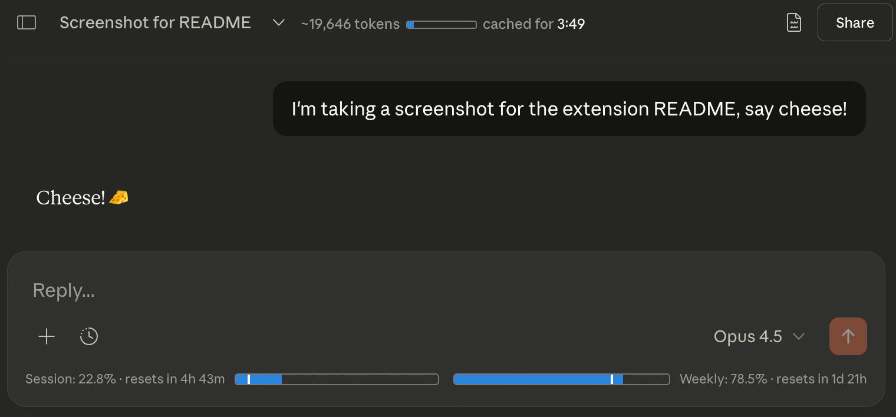
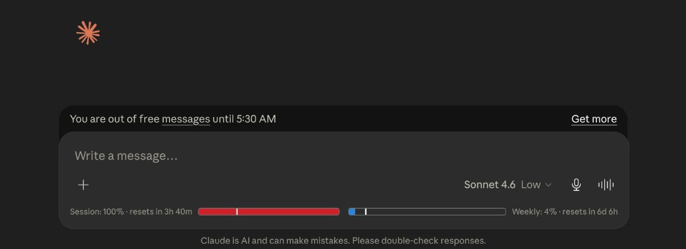
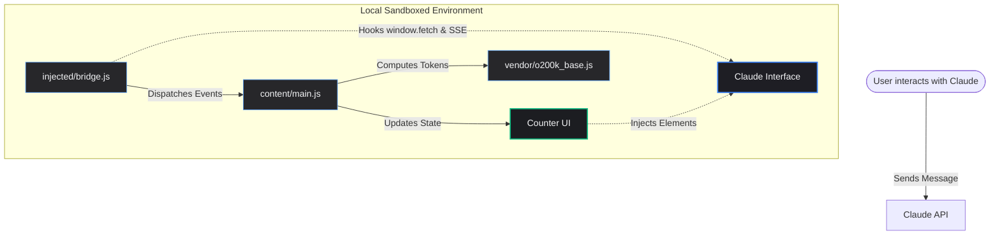

# 🪙 Claude Counter

<p align="center">
  
  
  
  
</p>

---

<p align="center">
  <b>A sleek, lightweight, and modern utility that brings real-time token counts, cache countdowns, and exact rolling usage analytics directly into your Claude.ai interface (Web & Desktop).</b>
</p>

<p align="center">
  
</p>

---

## ✨ Key Features

### 🪙 Real-Time Token Counter
* **Precise Offline Approximations:** Uses a local `o200k_base` tiktoken tokenizer (the native tokenizer for Claude 3 & 3.5 models) to estimate prompt size instantly.
* **Visual Context Gauge:** A mini progress bar displays your active usage against Claude's **200,000-token** context window.
* **Compaction Indicators:** Automatically adapts styling when Claude performs background context window compaction.

### ⏱️ Prompt Cache Countdown
* **Save up to 90%:** Anthropic caches active prompt contexts for up to **5 minutes**.
* **Live Expiration Timer:** Displays a live countdown timer showing when your cache expires. Send your next message before it hits `0:00` to continue from the cached state.

### 📊 Exact Rolling Usage Analytics
* **SSE Interception:** Hooks directly into Claude's native Server-Sent Events (SSE) `message_limit` stream to extract precise, raw usage fractions.
* **Session & Weekly Trackers:** Beautiful progress bars visualize your 5-hour rolling session window and 7-day weekly usage.
* **Reset Timers:** Live countdowns show exactly when your usage quotas will renew.

<p align="center">
  
</p>

---

## 🛠️ How It Works

Claude Counter runs **100% locally and privately**. It intercepts data streams and calculates metrics directly in your client session without any external network overhead.



---

## 📦 Simple Installation Guide

Choose your preferred way to run Claude Counter:

### 🌐 1. Google Chrome (Brave, Edge, Opera)
1. [Download the project ZIP](https://github.com/jaggureddy11/CLAUDE-TOKEN-COUNTER/archive/refs/heads/main.zip) and extract it to a folder on your computer.
2. Open your browser and navigate to `chrome://extensions/`.
3. Toggle **Developer mode** on (top-right corner).
4. Click **Load unpacked** (top-left corner) and select the project folder.

### 🦊 2. Firefox
1. Download the release `.xpi` file.
2. Drag and drop the `.xpi` file into any open Firefox tab, or go to `about:addons` and select **Install Add-on From File...** under the gear icon.

### 📜 3. Userscript (Tampermonkey / Violentmonkey)
1. Ensure you have a userscript manager extension active in your browser.
2. Click to install: [`claude-counter.user.js`](./userscript/claude-counter.user.js).

---

### 🖥️ 4. Claude Desktop Application (macOS & Windows)

You can run the token counter inside the official **Claude Desktop** client by using our automatic patching scripts.

#### Step 1: Download and Extract
1. [Download the project ZIP](https://github.com/jaggureddy11/CLAUDE-TOKEN-COUNTER/archive/refs/heads/main.zip) and extract it to a folder on your computer.

#### Step 2: Run the Patch Script
* **macOS:**
  Open your terminal in the extracted folder and run:
  ```bash
  ./patch-mac.sh
  ```
  *(The script automatically verifies Node.js, installs dependencies, patches the app, and signs the bundle).*
* **Windows:**
  1. Double-click the `patch-windows.bat` file in the extracted folder.
  2. If Node.js is missing, it will display a link to download it. Install Node.js and run `patch-windows.bat` again.
  3. The script will open a command prompt, automatically install the required patching utility (`@electron/asar`), back up and patch your files, and output a success message.
  4. Press any key to close the console.

#### Step 3: Restart Claude
Completely close and relaunch **Claude Desktop**. The token counter will now be active in the application window!

> [!TIP]
> **To Restore / Uninstall:** If you ever want to revert the changes, delete the modified `app.asar` inside the application resources folder and rename the automatically created `app.asar.bak` backup file back to `app.asar`.

---

## 🔒 Privacy Guarantee

* **Zero External Traffic:** Token calculation, cookie lookups, and event interception are processed entirely locally. No external APIs, analytic endpoints, or trackers are contacted.
* **Standard Credentials:** Claude Counter uses the standard `lastActiveOrg` cookie to make authenticated calls directly to Claude's native `/usage` endpoint.

---

## 📄 License

This project is licensed under the [MIT License](./LICENSE).
