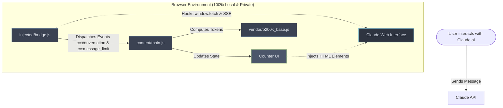

# 🪙 Claude Counter

<p align="center">
  
  
  
  
</p>

---

<p align="center">
  <b>A sleek, lightweight, and modern browser utility that brings real-time token counts, cache countdowns, and exact rolling usage analytics directly into your Claude.ai interface.</b>
</p>

<p align="center">
  
</p>

---

## ✨ Features

### 🪙 Real-Time Token Counter
- **Precise Offline Approximations:** Uses a vendored `o200k_base` tiktoken tokenizer (the native tokenizer for Claude 3 & 3.5 models) to estimate prompt size locally.
- **Visual Context Gauge:** A sleek mini progress bar displays usage against Claude's **200,000-token** context window.
- **Compaction Indicators:** Automatically adapts styling when Claude performs background context window compaction.

### ⏱️ Cheaper-to-Continue Cache Timer
- **Prompt Caching Support:** Anthropic caches active prompt contexts for up to **5 minutes**.
- **Live Countdown:** Displays a countdown timer showing when the cache expires.
- **Save up to 90%:** Message before the timer hits `0:00` to continue from the cached state, drastically reducing token consumption and costs.

### 📊 Exact Rolling Usage Analytics
- **Session & Weekly Trackers:** Visualizes your 5-hour rolling session window and 7-day weekly usage.
- **SSE Interception:** Rather than rounded, lagging figures from Claude's `/usage` page, the tool hooks into the active Server-Sent Events (SSE) `message_limit` stream to extract and render precise, raw usage fractions.
- **Reset Timers:** Live countdowns indicate the exact minute your usage quotas will renew.

---

## 🛠️ How It Works

Here is a visual flow of how Claude Counter captures, analyzes, and injects metrics locally without affecting performance:



---

## 📦 Installation

### 🌐 Chromium-based (Chrome, Edge, Brave, Opera)
1. Download [`claude-counter-0.4.2.zip`](../../releases/download/v0.4.2/claude-counter-0.4.2.zip).
2. Extract the contents to a local folder of your choice.
3. Open your browser and navigate to `chrome://extensions`.
4. Toggle **Developer mode** on in the top-right corner.
5. Click **Load unpacked** in the top-left and select the extracted folder.

### 🦊 Firefox
1. Download [`claude-counter-0.4.2.xpi`](../../releases/download/v0.4.2/claude-counter-0.4.2.xpi).
2. Drag and drop the `.xpi` file into any open Firefox window, or install it via the gear icon in `about:addons`.
3. Approve permissions and click **Add**.

### 📜 Userscript (Tampermonkey / Violentmonkey)
1. Ensure a userscript manager browser extension is active.
2. Click to load the raw file: [`claude-counter.user.js`](./userscript/claude-counter.user.js).
3. Confirm the installation in your userscript manager's dashboard.

---

## 🔒 Privacy Guarantee

> [!NOTE]
> **No External Traffic:** Token calculation, cookie lookups, and event interception are processed entirely locally. No external APIs, analytic endpoints, or trackers are contacted.
> 
> **Zero Credential Sharing:** Claude Counter uses the standard `lastActiveOrg` cookie to make authenticated calls directly to Claude's native `/usage` endpoint.

---

## 💻 Local Development

If you want to contribute or build locally:

1. Clone the repository:
   ```bash
   git clone https://github.com/she-llac/claude-counter.git
   cd claude-counter
   ```
2. **Repository Architecture:**
   - [`src/content/`](./src/content/) — Extention content scripts (UI rendering, tokenization drivers, orchestrator).
   - [`src/injected/`](./src/injected/) — Webpage-level API interception hooks (`bridge.js`).
   - [`src/vendor/`](./src/vendor/) — Tiktoken tokenizer library assets.
   - [`userscript/`](./userscript/) — Bundled single-file userscript package.

To test changes, load the root folder unpacked in your browser's extension developer mode, or copy updates straight into the userscript.

---

## 🤝 Credits

- Tokenization library powered by [gpt-tokenizer](https://github.com/niieani/gpt-tokenizer) (MIT).
- Inspired by [Claude Usage Tracker](https://github.com/lugia19/Claude-Usage-Extension) by lugia19.

---

## 📄 License

This project is licensed under the [MIT License](./LICENSE).
